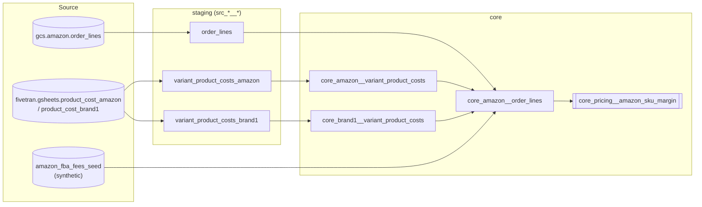

# Pricing / Margin Analytics (dbt)

A dbt project that turns Amazon marketplace order data into an actual
per-SKU profitability number: net revenue minus landed product cost, Amazon
referral commission, and FBA fulfilment fees, by SKU, country, and month.

## Background

This is real production dbt code from the same role as the
[Zendesk](../zendesk-support-analytics/) and
[Supply Chain](../supply-chain-analytics/) projects in this repo. Amazon
was one of several sales channels; `core_amazon__order_lines` already
computed commission, landed cost, and FBA fee per order line in the
original codebase — this project rebuilds that model cleanly (PII
removed, seed dependency made explicit and synthetic) and adds the piece
that didn't exist yet: an actual aggregated margin table
(`core_pricing__amazon_sku_margin`) that answers "is this SKU actually
profitable on Amazon" instead of leaving that as a manual spreadsheet
exercise on top of the order-line detail.

Brand names are anonymized as `brand1` (consistent with the Supply Chain
project) — this project only covers brand1's Amazon channel; brand2's
Amazon data wasn't part of what this project was built from.

## Problem this solves

`core_amazon__order_lines` already had all three cost components
(commission, landed cost, FBA fee) computed at the line-item level, but
nothing aggregated them into a number a pricing decision could actually be
based on — "should we drop this SKU's price" or "is this SKU worth
keeping on Amazon at all" required someone to pull the line-item table
into a spreadsheet and do the math by hand, SKU by SKU. `core_pricing__amazon_sku_margin`
is that aggregation, done once, governed, and queryable directly.

## Architecture



- **staging (`models/staging/pricing`)** — light typing/renaming, plus the
  same product-cost unpivot pattern used in Supply Chain Analytics.
- **core (`models/core`)** — `core_amazon__order_lines` is line-item grain
  with cost/fee components computed; `core_pricing__amazon_sku_margin` is
  the aggregated, queryable margin table.

Warehouse: **Snowflake** (`DIV0`, `DATE_TRUNC`, `LATERAL FLATTEN`,
`OBJECT_CONSTRUCT_KEEP_NULL` throughout).

## Metric glossary

| Metric | Definition | Model |
|---|---|---|
| Net revenue | `paid_amount_net` summed per SKU/country/month — item price net of tax, plus discounts, shipping, and gift wrap, excluding tax | `core_pricing__amazon_sku_margin` |
| Product cost | Landed cost per unit (Amazon-channel cost sheet + brand1 base cost sheet, summed) × units shipped | `core_amazon__order_lines`, aggregated in the margin model |
| Commission cost | `paid_amount_net x 0.15` — a flat assumed Amazon referral commission rate | `core_amazon__order_lines` |
| FBA fee | Expected domestic fulfilment fee per unit from the FBA fee seed, converted to EUR for PLN-denominated rows, × units shipped | `core_amazon__order_lines` |
| Contribution margin | `net_revenue - product_cost - commission_cost - fba_fee` | `core_pricing__amazon_sku_margin` |
| Contribution margin % | `contribution_margin / net_revenue`, DIV0-guarded | `core_pricing__amazon_sku_margin` |

Full column-level descriptions live in `models/core/_core_pricing__models.yml`.

## Known limitations

- **The 15% commission rate is hardcoded**, not read from an actual
  Amazon fee schedule (which varies by category and can change). Kept as
  real production logic rather than parameterized, since it's
  transformation logic and not a data leak on its own — but it means this
  margin number is only as accurate as that flat assumption. If category
  actually varies, this over- or understates margin per category.
- **The PLN→EUR conversion in the FBA fee calculation uses a hardcoded
  0.23 rate**, and only handles PLN — every other currency in the FBA fee
  seed is assumed to already be in the model's base currency. If the
  brand sells in other non-EUR markets (GBP, for instance), their FBA
  fees would silently pass through unconverted here.
- **No logistics cost allocation.** `core_amazon__logistic_costs` (freight,
  palletizing) exists in the Supply Chain project but isn't joined in here
  — it's captured at shipment level, not SKU level, and there's no
  allocation rule (per unit? per shipment? by weight?) specified anywhere
  in the source data to bring it down to SKU grain. Contribution margin
  here is therefore an upper bound, not the fully-loaded margin.
- **`amazon_fba_fees_seed.csv` is fully synthetic** (see below) — the real
  fee schedule isn't in this repo, so margin numbers computed by actually
  running this project against real order data would be directionally
  right but numerically wrong until the real seed replaces it.
- **Only brand1's Amazon channel is covered.** Brand2's Amazon order data
  (if brand2 sells there at all) wasn't part of what this project was
  built from.
- **No incremental materialization**, and test coverage is intentionally
  light — same posture as the other two projects in this repo.

## What was changed for this repo

- Buyer PII (`buyer_email`, `buyer_name`, `buyer_phone_number`) and all
  ship-to/bill-to address fields are dropped entirely at the staging
  layer — not just unused downstream, not selected at all.
- `amazon_fba_fees_seed.csv` is synthetic sample data (three example SKUs,
  a few countries/currencies) — the original seed with real fee data isn't
  included.
- A dead no-op (`... + order_lines.shipment_discount_amount * 1 AS
  total_discount`) in the original `core_amazon__order_lines` is cleaned
  up to drop the `* 1` — same value, no behavior change.
- Brand name anonymized to `brand1`, consistent with the Supply Chain
  Analytics project.
- `core_pricing__amazon_sku_margin` is new — it didn't exist in the
  original codebase. This is the actual "pricing decision" deliverable;
  everything else here is the (real, pre-existing) data it's built from.

## Running this project

This project reads from a Snowflake warehouse populated by a GCS-based
Amazon ingest job and Fivetran's Google Sheets connector — it isn't
runnable standalone without those sources. To explore the SQL and lineage
without a warehouse connection:

```bash
dbt parse          # validates the DAG compiles
dbt docs generate && dbt docs serve   # browsable lineage graph + column docs
```

With a connected warehouse (and the synthetic seed swapped for real FBA
fee data):

```bash
dbt seed
dbt run
dbt test
```
