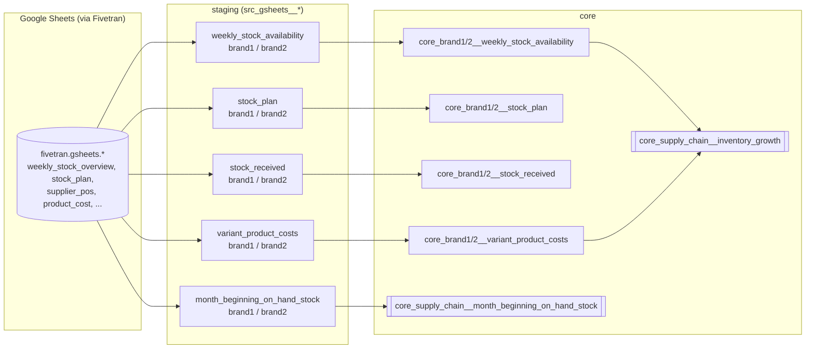

# Supply Chain Analytics (dbt)

A dbt project that turns manually maintained warehouse/planning spreadsheets
into the metrics a supply chain / inventory team runs on day to day: on-hand
stock by SKU, landed cost per SKU per month, inbound purchase orders, and a
year-over-year stock value growth metric -- across two brands.

## Background

This is real production dbt code from my time running supply chain /
inventory analytics (and customer care, see the
[Zendesk project](../zendesk-support-analytics/) in this repo) for a small
multi-brand e-commerce company. Unlike Zendesk -- which came from a proper
Fivetran connector -- most of this domain's source data is manually
maintained Google Sheets (weekly stock counts, purchase orders, product cost
sheets kept by hand by warehouse and finance staff), landed via Fivetran's
Sheets connector. That shows in the modeling: schema drift, inconsistent
date formats, and a query that got pasted into this repo as a raw, broken
draft before being rebuilt properly here (see
[Bugs fixed](#bugs-fixed-while-preparing-this-repo)).

**Brand names in this project are anonymized as `brand1` / `brand2`.**
That's a deliberately different call than the Zendesk project in this same
repo, which keeps the real brand names -- this domain carries supplier
relationships, landed cost, and inventory valuation, which felt like it
warranted an extra layer of redaction that ticket metadata didn't. See
[What was changed for this repo](#what-was-changed-for-this-repo).

## Problem this solves

The source-of-truth for "how much stock do we have and what's it worth" was
a set of hand-maintained spreadsheets, each shaped a little differently, per
brand. Nothing joined a SKU's on-hand quantity to its landed cost to compute
inventory value, and nothing tracked whether that value was growing or
shrinking year over year -- that comparison existed only as an ungoverned,
broken ad hoc query (`inventory_growth.sql` at the repo root, kept for
comparison) that people were copy-pasting and re-running by hand. This
project turns that into two governed core models: on-hand stock value
inputs, and `core_supply_chain__inventory_growth`, the actual YoY metric.

## Architecture



- **staging (`models/staging/supply_chain`)** -- one model per raw sheet,
  per brand. Light typing/renaming only, except the product-cost models,
  which unpivot a wide monthly-column sheet into one row per SKU per month
  (see [Bugs fixed](#bugs-fixed-while-preparing-this-repo) for a
  cross-model inconsistency worth checking there).
- **core (`models/core`)** -- `core_brandN__*` models are one-brand,
  near-1:1 passthroughs of their staging model (this domain doesn't
  currently combine brands until `inventory_growth`).
  `core_supply_chain__inventory_growth` is the presentation-layer metric a
  dashboard or analyst would actually query.

Warehouse: **Snowflake** (`DIV0`, `DATE_TRUNC`, `DATEADD`, `LATERAL FLATTEN`,
`OBJECT_CONSTRUCT_KEEP_NULL`, `TRY_TO_DATE` throughout).

## Metric glossary

| Metric | Definition | Model |
|---|---|---|
| Available stock | On-hand stock quantity per SKU, from the weekly stock-count sheet | `core_brandN__weekly_stock_availability` |
| Stock value | `available_stock x landed cost` for a SKU, cost matched by SKU + calendar month | `core_supply_chain__inventory_growth` |
| Stock Growth (pw/py %) | `(this week's total stock value - stock value 52 weeks ago) / stock value 52 weeks ago`, by brand and combined ("Total") | `core_supply_chain__inventory_growth` |
| Beginning-of-month on-hand stock | Starting inventory per SKU at the start of each month, excludes stock tied up in open orders | `core_supply_chain__month_beginning_on_hand_stock` |
| Landed cost | Cost per SKU per month, unpivoted from a hand-maintained wide sheet | `core_brandN__variant_product_costs` |
| Stock received | Inbound supplier purchase orders, bucketed to a planning month by order date (not delivery date) | `core_brandN__stock_received` |

Full column-level descriptions live in `models/core/_core_supply_chain__models.yml`
and `models/staging/supply_chain/_supply_chain__models.yml`.

## Bugs fixed while preparing this repo

`inventory_growth.sql` at the repo root is the original, exactly as it was
pasted in -- kept there deliberately so the diff is visible, rather than
silently disappearing. It does not run. `core_supply_chain__inventory_growth.sql`
here is the rebuilt, working version. What was actually wrong with the
original:

1. **Two CTEs joined and filtered on tables that don't exist in the query
   at all** -- `weekly_stock_availability` and `variant_product_costs` are
   referenced in the `ON` and `WHERE` clauses of the first two CTEs, but the
   only tables actually in scope there are `weekly_stock` and `prod_cost`.
2. **`DATE_TRUNC(week, ...)` / `DATE_TRUNC(month, ...)` were missing quotes**
   around the date-part argument (`'week'`, `'month'`) -- both would fail to
   parse as written.
3. **`Extract(year, reporting_date::DATE)` uses comma syntax**, which isn't
   valid in Snowflake -- `EXTRACT` requires `FROM`. Replaced with
   `DATE_PART('year', ...)`.
4. **`pw_stock` and `py_stock` both selected from an alias that was never
   defined** (`sku_value_pw` / a mix of `sku_value_pw` and `sku_value_py`)
   instead of the actual CTE names, `stock_value_pw` / `stock_value_py`.
5. **The final join aliased nothing** -- `FROM pw_stock LEFT JOIN py ON
   pw.brand = py.brand` refers to aliases `pw` and `py` that were never
   assigned to `pw_stock` / `py_stock` in that `FROM`/`JOIN`.
6. **Hardcoded absolute schema paths** (`dbt.prod_schema_brand1.prod_cost`,
   `dbt.prod_schema_brand1.weekly_stock`) instead of `{{ ref(...) }}` --
   rewired to reference the actual `core_brandN__weekly_stock_availability`
   and `core_brandN__variant_product_costs` models built out for this repo.

None of these are business-logic changes -- the metric definition (stock
value this week vs. the same week last year, by brand) is unchanged; every
fix above is either a syntax error or a broken reference.

## Known limitations

- **Brand 2's core layer didn't exist before this repo.** Only brand 1
  (`core_am__*` in the original codebase) had core models; brand 2's data
  only had staging models. `core_brand2__weekly_stock_availability`,
  `core_brand2__stock_plan`, `core_brand2__stock_received`, and
  `core_brand2__variant_product_costs` are added here, mirroring brand 1's
  exact shape, so `inventory_growth` could be rebuilt properly and to
  complete the domain. These are new, not "real production code" like the
  rest of this repo -- flagged inline in each file.
- **`core_supply_chain__month_beginning_on_hand_stock`'s source sheets have
  no brand column at all**, unlike every other sheet in this domain. Brand
  is added at the staging layer as a literal rather than read from the
  source -- fine as long as one sheet only ever covers one brand, but there's
  no way to catch it in the data if that assumption is ever violated.
- **The product-cost unpivot models (`variant_product_costs_brand1/2`) and
  the pre-existing Amazon-channel one (`core_amazon__variant_product_costs`,
  via its staging model) exclude a slightly different set of non-numeric
  keys** -- the brand1/2 sheets exclude `'PRODUCT_NAME'` from the flatten,
  the Amazon one doesn't. If the Amazon sheet ever gains a `PRODUCT_NAME`
  column, that model would break on the `::FLOAT` cast. Not fixed here
  since the Amazon model is out of scope for this project; noted in
  `_supply_chain__models.yml`.
- **`core_brandN__stock_received.planning_month` is derived from
  `order_date`, not `delivery_date`.** A PO placed in March but delivered in
  April is bucketed to March -- intentional-looking (matches how the sheet
  itself is organized) but worth confirming with whoever owns procurement
  reporting.
- **No incremental materialization** -- same as the Zendesk project, every
  model here is a `view` (core models are `table`s rebuilt in full).
- **No tests beyond a handful of `unique`/`not_null`/`accepted_values`** --
  intentionally light, to keep this repo focused on the modeling logic.

## What to review before this goes fully public

Two things worth a second look before treating this repo as fully scrubbed,
flagged rather than silently decided on my end:

- **`core_brandN__stock_received` carries `vendor_name` and
  `vendor_country`** -- real supplier relationships, not personal data, and
  arguably core to what a supply chain project is *for* (lead time and
  vendor performance analysis need to know who the vendor is). Left in for
  now since it's a column reference in transformation SQL, not a real name
  hardcoded into the file -- no actual vendor data lives in this repo. If a
  future sample dashboard needs example rows, those should be synthetic
  vendor names, matching how `zendesk_assignee_names_seed.csv` is synthetic
  in the Zendesk project.
- **This project's brand names are anonymized; the Zendesk project in the
  same repo names the real brands** ("Ava & May", "faynt") in its README.
  That's an inconsistency across the two projects in one repo -- worth
  deciding whether to align them (redact Zendesk's too, or de-anonymize
  this one) rather than leaving the split as-is.

## What was changed for this repo

- Brand names replaced with `brand1` / `brand2` throughout -- model names,
  config aliases, source table names, and the literal brand values selected
  in SQL. The real mapping isn't recorded anywhere in this repo.
- Staging models rewired from hardcoded `FROM fivetran.gsheets.table_name`
  references to a declared `{{ source(...) }}` (see
  `_supply_chain__sources.yml`) -- the original files referenced the
  warehouse directly.
- `inventory_growth.sql`'s hardcoded `dbt.prod_schema_brandN.*` paths
  replaced with `{{ ref(...) }}` calls to this project's own core models.
- Brand 2's core layer (4 models) added net-new -- see
  [Known limitations](#known-limitations).

## Running this project

This project reads from a Snowflake warehouse populated by Fivetran's
Google Sheets connector -- it isn't runnable standalone without that
source. To explore the SQL and lineage without a warehouse connection:

```bash
dbt parse          # validates the DAG compiles
dbt docs generate && dbt docs serve   # browsable lineage graph + column docs
```

With a connected warehouse:

```bash
dbt run
dbt test
```
