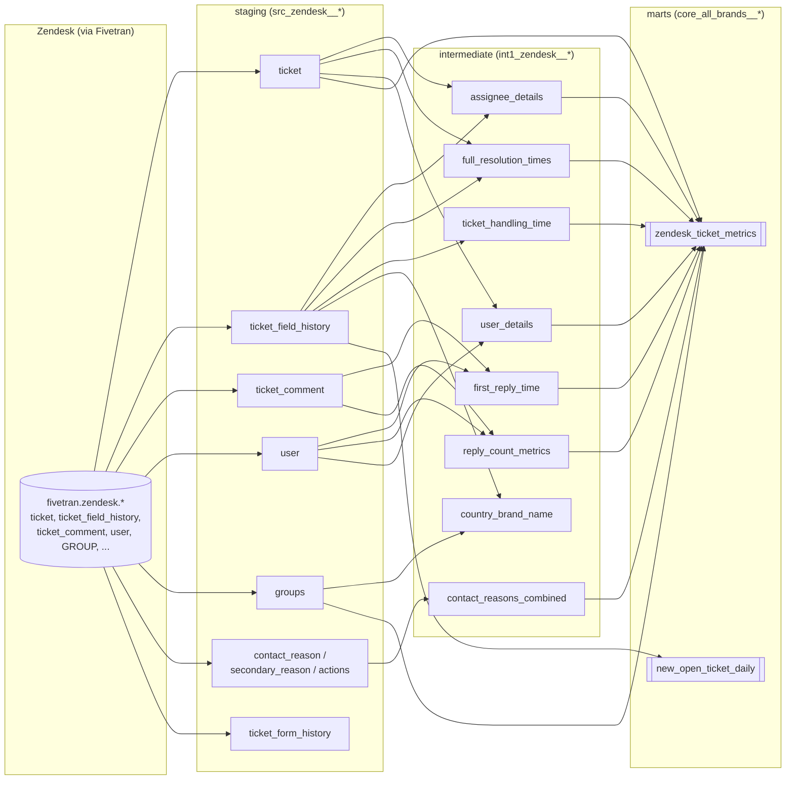

# Zendesk Customer Care Analytics (dbt)

A dbt project that turns raw Zendesk Support data into the metrics a customer
care team runs on day to day: first response time, handling time, resolution
time, contact rate, one-touch resolution, and contact-reason breakdowns —
across multiple brands and countries.

**[Live demo — sample KPI dashboard](https://claude.ai/code/artifact/28b75b5d-f27a-45af-b383-427a803f76eb)**
built on synthetic data, shaped to the schema of the core model below (see
[Sample dashboard](#sample-dashboard) for why it's synthetic).

## Background

This is real production dbt code from my time running customer care (and
supply chain) analytics for a small multi-brand e-commerce company. Zendesk
was the support desk for two consumer brands across five European markets;
this project is the pipeline that turned raw Zendesk activity into the KPIs
the customer care team, and leadership, actually looked at. Company- and
employee-identifying details have been trimmed or replaced with placeholders
(see [What was changed for this repo](#what-was-changed-for-this-repo)) but
the modeling logic, the business rules, and the rough edges are otherwise
left as they were written.

In the wider role, this was one piece of an analytics stack that also covered
supply chain / inventory analytics (fed from Shopify + warehouse data via
Fivetran and GCS) and ad-hoc reporting for marketing, finance, and
operations. This repo scopes to the customer care / Zendesk piece.

## Problem this solves

Zendesk's own reporting answers "how many tickets are open." It doesn't
answer "is Brand1's German queue missing SLA because of one agent's
backlog" or "which contact reason is driving repeat contacts this month" —
that requires joining ticket state, field-change history, comment activity,
and a business-hours calendar together, and doing it consistently across
brands that use Zendesk slightly differently. That's what this project does:
one governed fact table (`core_all_brands__zendesk_ticket_metrics`) that a
BI tool or analyst queries directly, instead of every dashboard re-deriving
FRT or handling time its own way.

## Architecture



Three layers, one direction of dependency:

- **staging (`models/staging/zendesk`)** — one model per raw Zendesk table, light
  typing/renaming/timezone conversion only. No business logic.
- **intermediate (`models/intermediate`)** — one concern per model: who's assigned,
  first reply time, resolution time, handling time, touch counts, contact
  reason. Each is independently testable and reusable.
- **marts (`models/marts`)** — `core_all_brands__zendesk_ticket_metrics`, the
  one-row-per-ticket fact table everything above feeds into, plus a smaller
  daily new/open ticket feed.
- **utils (`models/utils`)** — shared building blocks that don't belong to any
  one layer above (see [utils__day_light_saving](#known-limitations)).

Warehouse: **Snowflake** (the SQL uses `DIV0`, `TRY_CAST`, `LISTAGG`,
`QUALIFY`, `CONVERT_TIMEZONE` throughout).

## Metric glossary

| Metric | Definition | Model |
|---|---|---|
| First Response Time (FRT) | Time from ticket creation to the first **internal** (agent/admin) comment, on non-proactive tickets | `int1_zendesk__first_reply_time` |
| Average Handling Time (AHT) | Cumulative agent-active time on a ticket, from a Zendesk time-tracking custom field | `int1_zendesk__ticket_handling_time` |
| Full resolution time | Business-hours-adjusted time from creation to `solved` status (Mon–Fri 07:00–18:00 Europe/Berlin) | `int1_zendesk__full_resolution_times` |
| One-touch / two-touch resolution | Solved in fewer than 2 / exactly 2 public agent replies | `int1_zendesk__reply_count_metrics` |
| Proactive ticket | Opened by an agent/admin on a non-voice, non-chat channel — i.e. the business reached out first | `core_all_brands__zendesk_ticket_metrics` |
| Contact reason / secondary reason / action | The "why did they contact us" taxonomy, mapped from the ticket form and custom fields | `int1_zendesk__contact_reasons_combined` |
| Hand-off count | Distinct agents assigned to a ticket over its life | `int1_zendesk__assignee_details` |

Full column-level descriptions live in each layer's `_*.yml` schema file —
`models/marts/_core_zendesk__models.yml` is the most useful one to skim.

## Sample dashboard

I don't have access to the original company's Mode Analytics / Metabase
dashboards anymore, so [`dashboard/customer_care_dashboard.html`](dashboard/customer_care_dashboard.html)
is a from-scratch reconstruction on **synthetic data**, shaped to match the
columns in `core_all_brands__zendesk_ticket_metrics`: FRT/AHT/contact-rate
KPI tiles, a 30-day new/open ticket trend, a contact-reason breakdown, and a
resolution touch-mix chart by brand. It's meant to show what this data model
is *for*, not to represent real ticket volumes. Open the file directly, or
see the live version linked at the top of this README.

## Known limitations

- **Business hours are hardcoded, and don't account for daylight saving or
  non-EU timezones.** `int1_zendesk__full_resolution_times` assumes a fixed
  Mon–Fri 07:00–18:00 Europe/Berlin window. `models/utils/utils__day_light_saving.sql`
  computes a DST flag (EU rule only: last Sunday of March → last Sunday of
  October) but isn't wired into the resolution-time model yet — the natural
  next step would be applying it there, and adding the equivalent US rule
  (2nd Sunday of March → 1st Sunday of November) for any US-market tickets.
- **Assignee names depend on a manually maintained seed** (`zendesk_assignee_names_seed`)
  rather than Zendesk's own user table, so new agents show up by ID until the
  seed is updated. `seeds/zendesk_assignee_names_seed.csv` here is synthetic
  sample data, not the real mapping.
- **No incremental materialization.** Every model is a `view` (marts are
  `table`s rebuilt in full) — fine at this data volume, but a larger
  ticket history would want `is_incremental()` on the field-history-derived
  models.
- **Test coverage is intentionally light** (a handful of `unique`/`not_null`/`accepted_values`
  tests) rather than exhaustive, to keep this repo focused on the modeling
  logic itself.

## Bugs fixed while preparing this repo

Two issues in `core_all_brands__zendesk_ticket_metrics.sql` were fixed here
(the originals are preserved in the "what changed" note in that file's SQL
comments, and in this README, rather than silently disappearing):

1. **`LEFT JOiN` typo** on the `user_details` join — cosmetic, but broken
   capitalization like this is exactly what a linter (or `sqlfluff`) would
   catch; there's no CI on the original project, which is itself a known gap.
2. **Assignee-name lookup drove from the wrong side of the join.** The
   original built the ticket → agent-name lookup as `FROM zendesk_assignee_names_seed
   LEFT JOIN int1_zendesk__assignee_details`, with `COALESCE(names_seed.assignee_name,
   'names_seed.assignee_id')` — a quoted string literal, not the column it
   looks like it's meant to be. Two consequences: any ticket whose assignee
   wasn't already present in the manually maintained seed was silently
   dropped from the lookup (not just unnamed — *missing*), and the intended
   fallback to the raw ID never actually fired. Fixed by driving from
   `int1_zendesk__assignee_details` (so every ticket is preserved) and
   coalescing to the real `assignee_details.last_assigned` column.

## What was changed for this repo

This is real code, lightly redacted for a public repo rather than rewritten:

- Zendesk custom field IDs that were hardcoded magic numbers (e.g. the
  handling-time tracking field) are replaced with the placeholder
  `360000000000` and documented inline with what the real field represents.
- `src_zendesk__ticket.sql` originally selected 90+ `custom_*` columns —
  effectively a fingerprint of the business's exact product catalog (candle
  components, diffuser components, room spray, etc.). This copy keeps a
  representative subset; nothing downstream in this repo depends on the
  trimmed columns.
- Seed data (`zendesk_assignee_names_seed.csv`) is fully synthetic — no real
  employee names.
- Brand names (Brand1, Brand2), the `fivetran.zendesk` source schema, and
  the country/business logic are left as-is; they aren't sensitive on their
  own without the data behind them.

## Running this project

This project reads from a Snowflake warehouse populated by Fivetran's
Zendesk connector (`fivetran.zendesk.*`) — it isn't runnable standalone
without that source. To explore the SQL and lineage without a warehouse
connection:

```bash
dbt parse          # validates the DAG compiles
dbt docs generate && dbt docs serve   # browsable lineage graph + column docs
```

With a connected warehouse:

```bash
dbt seed            # loads the synthetic seeds
dbt run
dbt test
```
